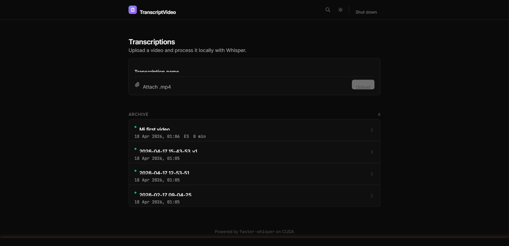

# TranscriptVideo

<p align="left">
  <a href="../LICENSE"></a>
  
  
  
  <a href="../README.md"></a>
</p>

> Transcripcion de video self-hosted que corre enteramente en tu propia GPU. Subi un video, obtene una transcripcion precisa. Sin nube, sin API keys, sin que los datos salgan de tu maquina.

Construido sobre [faster-whisper](https://github.com/SYSTRAN/faster-whisper) con una UI web minimalista en FastAPI + Alpine.js. Pensado para uso personal sobre Tailscale/VPN — subi desde cualquier dispositivo, procesa en la maquina con la GPU.



## Features

- **Solo local** — Whisper corre en tu GPU, los videos nunca salen de la maquina
- **Web UI** — subir, cola, progreso en vivo, leer + descargar transcripciones
- **Tema oscuro / claro** — interfaz minimalista estilo Linear/Vercel, oscuro por defecto
- **Cola FIFO** con cancelacion (un job a la vez, limitado por GPU)
- **Progreso en vivo via SSE** — actualizaciones en tiempo real por segmento
- **Busqueda full-text** sobre todas las transcripciones pasadas (SQLite FTS5)
- **Nombres editables** — renombra transcripciones despues
- **Conservar o borrar** el video fuente por job
- **Deteccion automatica de idioma** — principalmente espanol + ingles, otros soportados
- **Limpieza de alucinaciones** — post-procesado deterministico elimina los artefactos tipicos de Whisper (`no no no no`, `Si. Si. Si.`)
- **CLI fallback** — `transcribe.py` sigue funcionando standalone para uso por scripts
- **Sin Node.js** — el frontend es un unico template Jinja2 + Alpine.js + Tailwind via CDN

## Por que existe

Los servicios de transcripcion en la nube son rapidos y comodos, pero tienen contras reales: mandas tu audio a servidores ajenos, pagas por minuto, y confias grabaciones tuyas a terceros que pueden cachearlas o analizarlas. Para contenido personal (reuniones, notas de voz, grabaciones de OBS) una GPU local transcribe mas rapido que el tiempo real con calidad `large-v3` — solo falta una UI decente alrededor.

Este proyecto envuelve el workflow estandar de faster-whisper en una webapp chica para que puedas subir desde tu laptop/celu por tu VPN, encolar jobs, y obtener transcripciones buscables sin tocar ninguna API de terceros.

## Requisitos

- **Windows 11** con **WSL2** (distro Ubuntu)
- **GPU NVIDIA** con drivers + CUDA (WSL2 usa el driver de Windows via el passthrough CUDA de NVIDIA)
- **Python 3.12** dentro de WSL (`sudo apt install python3.12 python3.12-venv`)
- **Git** dentro de WSL
- **Tailscale** (opcional, para acceso desde otros dispositivos)

> Nota: el launcher apunta a WSL2 en Windows pero el backend es FastAPI plano — corre en cualquier Linux con CUDA. Reemplaza el `.bat` por un shell script si lo queres correr nativo.

## Instalacion (desde cero)

Todos los comandos corren **dentro de WSL** (no en CMD/PowerShell).

### 1. Clonar

```bash
cd /mnt/c/Development
git clone https://github.com/Mykle23/transcriptvideo.git
cd transcriptvideo
```

### 2. Crear el venv

```bash
python3 -m venv venv
source venv/bin/activate
```

### 3. Instalar dependencias

```bash
python -m pip install --upgrade pip
python -m pip install -r requirements.txt
```

> La primera instalacion baja ~2 GB (PyTorch + CUDA + ctranslate2). Tarda varios minutos.

### 4. Verificar CUDA

```bash
python -c "from faster_whisper import WhisperModel; WhisperModel('tiny', device='cuda'); print('CUDA OK')"
```

### 5. (Opcional) Pre-descargar el modelo

El primer uso real con `large-v3` baja ~3 GB. Pre-descargalo ahora para evitar esperar despues:

```bash
HF_HUB_ENABLE_HF_TRANSFER=0 python -c "from faster_whisper import WhisperModel; WhisperModel('large-v3', device='cuda', compute_type='float16')"
```

> Usa siempre `HF_HUB_ENABLE_HF_TRANSFER=0`. Sin esto, el downloader paralelo puede crashear la WiFi en algunos PCs (ver Troubleshooting).

### 6. (Opcional) Correr los tests

```bash
pytest tests/ -v
```

Deberian pasar 21 tests.

## Uso

### Webapp

Doble clic en **`start-webapp.bat`** desde el escritorio de Windows.

- Abre `http://localhost:8000` en el navegador
- Arranca el servidor FastAPI dentro de WSL
- Carga el modelo Whisper en GPU (~10 s una vez cacheado)

Si el navegador muestra error de conexion, espera unos segundos y refresca (el servidor tarda un momento en arrancar).

**Acceso desde otros dispositivos (via Tailscale):**

```
http://<ip-tailscale-del-pc>:8000
```

El server bindea `0.0.0.0:8000`, asi que cualquier dispositivo en la misma red Tailscale lo puede alcanzar.

### CLI (uso directo)

```bash
source venv/bin/activate
python transcribe.py "mi_video.mp4"
```

Los videos deben estar en `videos/`. El output va a `transcriptions/<nombre-video>/transcription.txt`.

## Estructura del proyecto

```
transcriptvideo/
├── transcribe.py              # CLI standalone (legacy, sigue funcionando)
├── start-webapp.bat           # lanzador Windows (WSL + uvicorn + navegador)
├── videos/                    # archivos .mp4 (ignorado por git)
├── transcriptions/            # carpeta por job (ignorado por git)
│   └── <nombre>/
│       └── transcription.txt
├── webapp/
│   ├── app.py                 # FastAPI: rutas + lifespan + SSE
│   ├── config.py              # rutas y constantes
│   ├── database.py            # SQLite + busqueda FTS5
│   ├── transcriber.py         # transcripcion + limpieza de alucinaciones
│   ├── worker.py              # procesador de jobs background (FIFO, GPU-bound)
│   ├── templates/index.html   # UI single-page (Alpine.js + Tailwind)
│   └── static/app.js          # logica frontend (SSE, subida, busqueda, tema)
├── tests/
│   ├── conftest.py
│   ├── test_api.py            # tests de endpoints FastAPI
│   ├── test_database.py       # CRUD DB + FTS5
│   ├── test_integration.py    # flujo completo upload-a-delete
│   └── test_transcriber.py    # logica de limpieza de segmentos
├── requirements.txt
├── LICENSE
└── README.md
```

## Stack tecnico

| Capa | Tecnologia |
|------|------------|
| Transcripcion | faster-whisper, `large-v3`, CUDA float16 |
| Backend | FastAPI, uvicorn, SQLite (WAL + FTS5) |
| Frontend | Alpine.js + Tailwind CSS via CDN (sin Node.js, sin build) |
| Progreso en vivo | Server-Sent Events (SSE) |
| Runtime | WSL2 Ubuntu + GPU NVIDIA |

## Troubleshooting

### La WiFi se desconecta al iniciar el servidor por primera vez

**Sintoma:** al levantar el `.bat`, a los 1-2 min se cae la WiFi (no aparecen redes en Windows).

**Causa:** `faster-whisper` baja el modelo via `huggingface_hub`, que activa `hf_transfer` por defecto — un downloader agresivo en Rust con muchas conexiones paralelas. En algunos PCs (adapters WiFi basados en Realtek comunes en WSL2), esto crashea el stack de red de Windows.

**Fix:** el `start-webapp.bat` ya fuerza `HF_HUB_ENABLE_HF_TRANSFER=0` (descarga serial — mas lenta pero estable). Si bajas el modelo manualmente, exporta la misma variable:

```bash
export HF_HUB_ENABLE_HF_TRANSFER=0
python -c "from faster_whisper import WhisperModel; WhisperModel('large-v3', device='cuda', compute_type='float16')"
```

### "Unable to open file 'model.bin'" al arrancar el servidor

El cache esta corrupto o incompleto (blob `.incomplete` residual). Limpiar y reintentar:

```bash
wsl bash -c "rm -rf /root/.cache/huggingface/hub/models--Systran--faster-whisper-large-v3"
```

Relanza el `.bat` — descargara limpio.

### "Internal Server Error" en la pagina principal

Si `/` devuelve 500 pero `/api/jobs` funciona, tenes una version vieja de Starlette. El codigo usa la signatura moderna `templates.TemplateResponse(request, "index.html")`. Actualiza:

```bash
python -m pip install --upgrade starlette fastapi
```

## Notas

- El modelo Whisper se carga **una sola vez** al arrancar el servidor y se reutiliza en todos los jobs.
- El idioma se detecta automaticamente por video.
- El post-procesado elimina alucinaciones tipicas de Whisper: segmentos donde una palabra domina >75% (`no no no no ...`) colapsan a esa palabra, y corridas de 4+ segmentos cortos identicos consecutivos (`Si. Si. Si. Si.`) se fusionan.
- Las transcripciones existentes en disco (creadas con el CLI) se importan automaticamente a la DB en el primer arranque.
- No se necesita Node.js ni ningun paso de build para el frontend.

## Licencia

[MIT](../LICENSE) — usalo, forkealo, mandalo.
